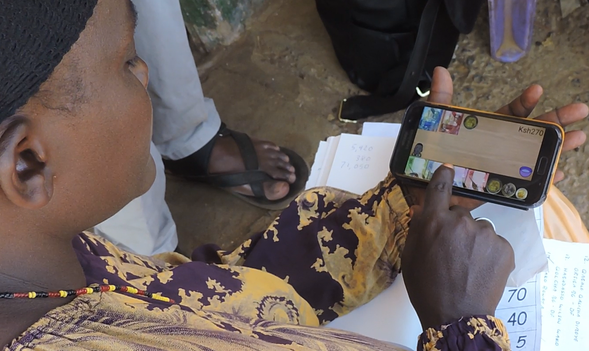
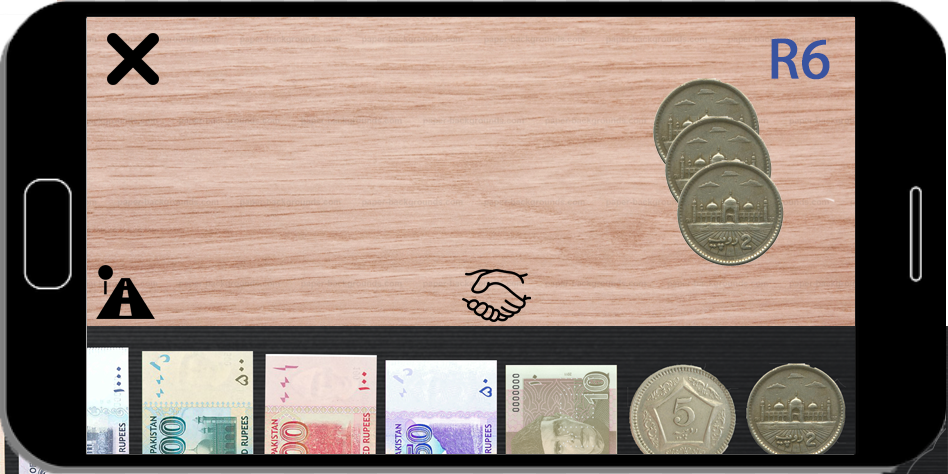

# Orali Table

Approximately a billion adults world-wide cannot decode place value notation. This is the arithmetic code that tells us that the ‘2’ in ‘4,200’ means ‘two hundred’ and not ‘two thousand’ or ‘twenty’, etc. Place value, along with a few other concepts like calendar time, tabular syntax and percent, undergird our entire economic and financial systems. Without the schooling to understand these concepts and decode their symbolic representations, buyers and sellers can’t understand written records of their own economic transactions.

We can change this.

Our solutions begin with Orali Table™. Table is a ‘cash calculator’ that allows poorly-schooled entrepreneurs, like market vendors or farmers with small land-holdings, to calculate using numbers they are familiar with: those on the notes and coins they use every day. The Android app also has a memory function that allows the user to store up to fifty previous calculations in memory, facilitating later retrieval and record-keeping.

We are planning other apps, with the goal of bringing a full range of useful digital financial service to the world’s illiterate population, of whom two-thirds are women.

Please visit our website for more information: <https://oralimobile.ca/>
